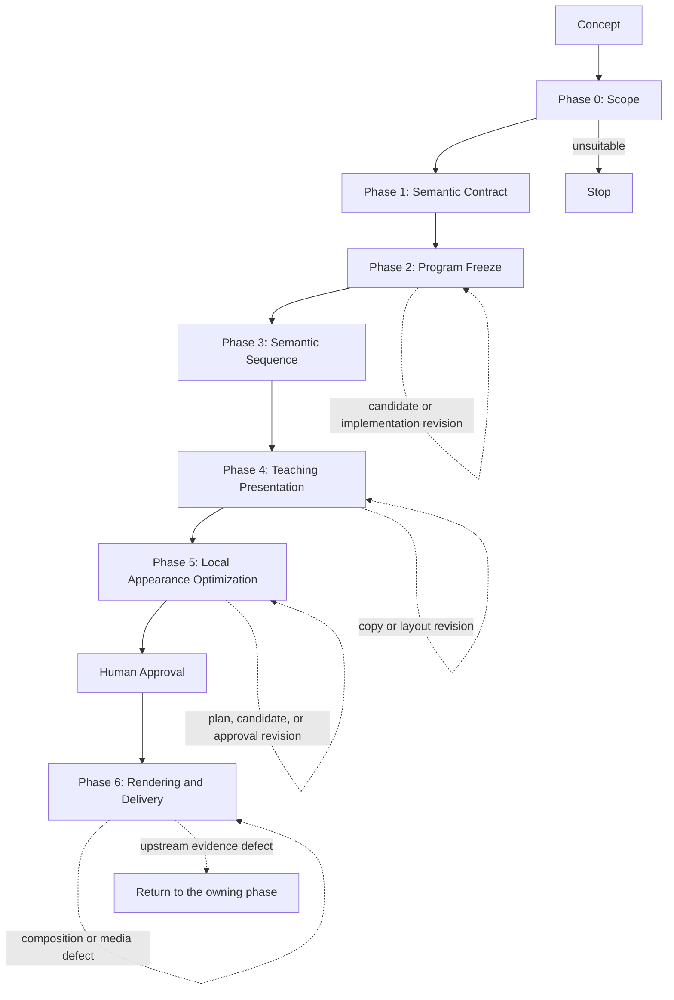

# Stage 5 — Live Document

Stage 5 turns one concept into a short, inspectable teaching animation. It narrows the concept, freezes semantic truth in a deterministic program, renders a complete semantic sequence, adds learner-facing teaching structure, applies locally generated appearance assets only through authoritative masks, and delivers validated PNG, MP4, and GIF outputs. The program remains authoritative for geometry, identity, causality, timing, and semantic state throughout.

## Main workflow



Phase 5 is mandatory in the product path. Phase 6 accepts only explicit approved Phase 4 and Phase 5 decisions.

## Phase overview

| Phase | Purpose | Main input | Main output | Primary owner |
|---|---|---|---|---|
| 0 — Scope | Reduce one concept to an 8–12 second teachable target or stop | Concept string | `scope.json` | Agent; caller validates |
| 1 — Semantic Contract | Define implementation-independent truth and evidence | Approved scope | `semantic-contract.json` | Agent; caller validates |
| 2 — Program Freeze | Execute shared-program candidates, review them, and freeze one exact configuration | Semantic contract | `plan.json`, `prototype.py`, probes, `selection.json`, `executable-spec.json` | Builder, Runtime, Reviewer |
| 3 — Semantic Sequence | Replay the frozen program over an explicit schedule | Frozen program and schedule | `sequence.npz`, `sequence-manifest.json` | Deterministic Runtime |
| 4 — Teaching Presentation | Bind semantic fields to learner labels and render the teaching layout | Semantic sequence and contract | `presentation.json`, teaching frames, `teaching-manifest.json`, human decision | Agent, Runtime, human |
| 5 — Appearance / Material Optimization | Generate and review bounded local material assets | Phase 3 state and Phase 4 bindings | appearance plan, execution, review, human decision, approved pack | Builder, local model, Runtime, Reviewer, human |
| 6 — Rendering and Delivery | Propagate approved appearance over the full sequence and validate delivery | Approved Phase 4/5 artifacts | final PNGs, MP4, GIF, evaluation, delivery manifest | Deterministic Runtime; human reviews delivery |

## Artifact map

```text
stage5/
├── README.md
├── run_pipeline.py
├── workflow/
│   ├── {WORKFLOW.md,PIPELINE_AGENT.md}
│   ├── phase0/{prompt.md,schema.json}
│   ├── phase1/{prompt.md,schema.json}
│   ├── phase2/{builder_prompt.md,reviewer_prompt.md,runtime.py,schema.json}
│   ├── phase3/{scheduler_prompt.md,runtime.py,schema.json}
│   ├── phase4/{prompt.md,runtime.py,schema.json}
│   ├── phase5/{builder_prompt.md,reviewer_prompt.md,runtime.py,schema.json}
│   └── phase6/{runtime.py,schema.json}
├── runs/karst-001/
│   ├── phase0/scope.json
│   ├── phase1/semantic-contract.json
│   ├── phase2-attempt-002/
│   │   ├── plan.json
│   │   ├── prototype.py
│   │   ├── candidates/<candidate-id>/{config.json,states,probes,probe-result.json}
│   │   ├── candidates/executor-summary.json
│   │   ├── selection.json
│   │   └── executable-spec.json
│   ├── phase3-regression-001/sequence/{sequence.npz,sequence-manifest.json}
│   ├── phase4-layout-v2-001/
│   │   ├── presentation.json
│   │   ├── candidate-dark-glass/{frames,teaching-manifest.json}
│   │   └── human-decision.json
│   ├── phase5-candidate-001/
│   │   ├── appearance-plan.json
│   │   ├── appearance-execution.json
│   │   ├── appearance-review.json
│   │   ├── human-decision.json
│   │   └── {generation,assets,probes,comparisons}
│   └── phase6-delivery-001/
│       ├── inputs/{sequence.npz,teaching-manifest.json,appearance-pack.json,...}
│       ├── frames/
│       ├── media/{karst-explainer.mp4,karst-explainer.gif}
│       ├── comparisons/
│       ├── final-evaluation.json
│       └── delivery-manifest.json
└── reports/
```

[`workflow/program_baseline/`](workflow/program_baseline/) is retained compatibility and historical implementation evidence. It is not the current product path. The karst appearance experiments numbered 001–004 are also case-specific historical evidence, not additional workflow phases.

## Running and inspecting the workflow

The thin, resumable entry point is `run_pipeline.py`. It emits bounded Agent tasks, calls the existing deterministic Runtime CLIs as subprocesses, records artifact hashes and immutable attempts, and pauses for real human choices at Phase 4 and Phase 5. It does not own or reimplement phase semantics.

Install the deterministic Runtime dependencies first:

```bash
python -m pip install -r modules/video_model/stage5/requirements.txt
```

Phase 5 local image generation additionally needs a separately provisioned PyTorch/Diffusers GPU environment and local model weights. They are intentionally not vendored into this repository.

Start a run from the repository root:

```bash
python modules/video_model/stage5/run_pipeline.py init \
  --concept "<concept>" \
  --run-id "<run-id>"
```

Resume it in a later process until the next Agent or human boundary:

```bash
python modules/video_model/stage5/run_pipeline.py status \
  --run modules/video_model/stage5/runs/<run-id>
python modules/video_model/stage5/run_pipeline.py next \
  --run modules/video_model/stage5/runs/<run-id> \
  --until-blocked
```

At an Agent pause, complete only the generated task under `runs/<run-id>/tasks/`. At a human pause, inspect the generated review packet and use its exact allowed ID with `approve`; the controller never converts its own recommendation into approval. See [`workflow/PIPELINE_AGENT.md`](workflow/PIPELINE_AGENT.md) for the compact controller procedure.

The phase Runtimes remain independently inspectable:

```bash
python modules/video_model/stage5/workflow/phase2/runtime.py --help
python modules/video_model/stage5/workflow/phase3/runtime.py --help
python modules/video_model/stage5/workflow/phase4/runtime.py --help
python modules/video_model/stage5/workflow/phase5/runtime.py --help
python modules/video_model/stage5/workflow/phase6/runtime.py --help
```

Common validation commands are:

```bash
python modules/video_model/stage5/workflow/phase3/runtime.py validate-manifest <sequence-manifest.json>
python modules/video_model/stage5/workflow/phase4/runtime.py validate-teaching-manifest <teaching-manifest.json>
python modules/video_model/stage5/workflow/phase5/runtime.py validate-pack <appearance-pack.json>
python modules/video_model/stage5/workflow/phase6/runtime.py validate-delivery-manifest <delivery-manifest.json>
```

Use each command's `--help` before constructing an execution call; the Runtimes require explicit inputs and new output roots.

## Where to make changes

- Scope policy: `workflow/phase0/prompt.md` and `schema.json`.
- Semantic vocabulary and authority boundaries: `workflow/phase1/prompt.md` and `schema.json`.
- Program proposal or review behavior: Phase 2 Builder or Reviewer prompt.
- Candidate execution and exact freezing: Phase 2 Runtime and schema.
- Timeline replay or semantic serialization: Phase 3 Runtime and schema.
- Teaching wording or semantic-role binding: Phase 4 prompt.
- Teaching layout or deterministic rendering contract: Phase 4 Runtime and schema.
- Material planning or review policy: Phase 5 Builder or Reviewer prompt.
- Local model adapters, bounded composition, approval, or pack assembly: Phase 5 Runtime and schema.
- Full propagation, encoding, evaluation, or delivery: Phase 6 Runtime and schema.

Keep concept-specific scripts and evidence under `runs/<run-id>/`; do not encode them in generic Runtime files.

## Maintenance rules

1. Preserve one authoritative representation for each semantic fact and invariant.
2. Keep Agent recommendation, deterministic evidence, and human approval separate.
3. Do not let generated appearance redefine masks, topology, timing, identity, or causal order.
4. Require real execution artifacts before claiming a candidate passed.
5. Write retries to new attempt roots; do not rewrite retained evidence.
6. Treat Phase 5 as mandatory and require its approved pack before Phase 6.
7. Update this README and [`workflow/WORKFLOW.md`](workflow/WORKFLOW.md) when ownership, artifacts, or routing changes.

## Current status

**Stage 5 Workflow v0.1 — end-to-end validated on karst.** All seven phases are implemented. The retained karst case exercised real local appearance generation, human-selected `candidate-dark-glass` and `candidate-002`, deterministic 120-frame delivery, H.264 MP4, looping GIF, evaluation, and manifest validation. The result is ready with accepted minor material/layout warnings for human delivery review; final human acceptance is not recorded.

Karst is the first retained end-to-end regression case, not evidence of broad generality. The next system-level test should use a structurally different concept. See the [engineering workflow guide](workflow/WORKFLOW.md). Generated runs and reports are intentionally excluded from source control.
