# Stage 5 Workflow

For the compact entry point, see [`../README.md`](../README.md).

# Document purpose

This is the shared engineering guide for Stage 5. It explains the implemented Phase 0–6 product path, artifact ownership, retry boundaries, and the files a teammate should change for each kind of work. Schemas remain the formal field-level contracts; this guide intentionally does not reproduce them.

# Product vision

Stage 5 turns one difficult concept into an 8–12 second explanatory animation. A deterministic program establishes the mechanism and complete state sequence. A bounded local image model improves material and visual richness without changing semantic truth. Deterministic composition then produces inspectable delivery artifacts.

The central rule is:

> The program owns semantic truth. Generated appearance may enrich it, but may not redefine it.

# Fixed product assumptions

- External input: exactly one concept string.
- Audience: middle-school students and general adults encountering the concept for the first time.
- Language: English.
- Normal duration: 8–12 seconds, typically about 10 seconds.
- Scope should be narrowed before duration is extended beyond 12 seconds.
- Geometry, identity, causal order, timing, and semantic masks remain program-owned.
- Appearance generation runs locally and is mandatory in the official product path.
- The workflow, not the caller, defines the final output package.
- There is no `user-request.json`. The thin all-phase coordinator owns resumability and routing only; phase prompts, schemas, Runtimes, and human decisions retain their existing authority.

# Authority model

| Owner | Authority |
|---|---|
| Program | Semantic truth, geometry, state, identity, causality, timing, and authoritative masks |
| Agent | Bounded scope and semantic authoring, program and appearance planning, teaching wording, candidate proposals, and review recommendations |
| Local image model | Bounded material, texture, lighting, and non-semantic appearance assets |
| Deterministic Runtime | Schema and lineage validation, real execution, composition, serialization, replay checks, encoding, and delivery evidence |
| Human | Product approval and candidate/style selection |

Agent recommendation, Runtime evidence, and human approval are separate artifacts. None substitutes for another.

# Core architectural principles

## Progressive freezing

Decisions freeze at the phase that owns them:

```text
scope
→ semantic obligations
→ program implementation and tested configuration
→ full semantic timeline
→ teaching presentation and layout selection
→ appearance selection
→ final delivery
```

A downstream phase may reference an upstream decision but may not silently rewrite it.

## Semantic requirements precede implementation

Phase 1 says what must remain true. Arrays, coordinates, update equations, thresholds, and rendering algorithms belong to Phase 2 or later.

## Real execution precedes acceptance

Builder and Reviewer Agents work from plans and real artifacts. Deterministic Runtime executes candidates, records failures, runs checks, and freezes exact tested values. A candidate is not considered executed because an Agent says it ran.

## Attempts are immutable

Retries use new output roots. Failed runs and negative-gate evidence remain available for diagnosis.

## Generic Runtime, case-specific runs

Generic Runtime files must not contain concept-specific fields, geometry, colors, prompts, masks, or frame choices. Those belong under `runs/<run-id>/`.

# Current static workflow tree

```text
modules/video_model/stage5/workflow/
├── WORKFLOW.md
├── PIPELINE_AGENT.md
├── phase0/
│   ├── prompt.md
│   └── schema.json
├── phase1/
│   ├── prompt.md
│   └── schema.json
├── phase2/
│   ├── builder_prompt.md
│   ├── reviewer_prompt.md
│   ├── runtime.py
│   └── schema.json
├── phase3/
│   ├── scheduler_prompt.md
│   ├── runtime.py
│   └── schema.json
├── phase4/
│   ├── prompt.md
│   ├── runtime.py
│   └── schema.json
├── phase5/
│   ├── builder_prompt.md
│   ├── reviewer_prompt.md
│   ├── runtime.py
│   └── schema.json
├── phase6/
│   ├── runtime.py
│   └── schema.json
└── program_baseline/
    ├── presentation_prompt.md
    ├── scheduler_prompt.md
    ├── runtime.py
    └── schema.json
```

Each phase schema may contain several document definitions under `$defs`. Logical responsibilities remain separate even when one Runtime or schema file serves several commands.

# Resumable orchestration

`../run_pipeline.py` is the formal concept-to-delivery coordinator. It records an atomic `run-state.json`, hashes registered artifacts, creates immutable attempt roots, emits self-contained Agent tasks, invokes each existing Runtime through its CLI, and stops at Phase 4 and Phase 5 for explicit human decisions. It does not import phase Runtime modules, choose human approvals, or redefine phase contracts. [`PIPELINE_AGENT.md`](PIPELINE_AGENT.md) is the controller prompt; [`phase3/scheduler_prompt.md`](phase3/scheduler_prompt.md) formally covers the previously implicit Phase 3 Agent scheduling step.

The canonical new-run layout is:

```text
runs/<run-id>/
├── run-state.json
├── tasks/
├── decisions/
├── logs/
├── reports/
├── phase0/attempt-NNN/
├── phase1/attempt-NNN/
├── phase2/attempt-NNN/
├── phase3/attempt-NNN/
├── phase4/attempt-NNN/
├── phase5/attempt-NNN/
└── phase6/attempt-NNN/
```

Initialize and resume from the repository root:

```bash
python modules/video_model/stage5/run_pipeline.py init --concept "<concept>" --run-id "<run-id>"
python modules/video_model/stage5/run_pipeline.py next --run modules/video_model/stage5/runs/<run-id> --until-blocked
```

Use `status` after interruption, `approve` only with an actual human selection and notes, `retry` to allocate a fresh owning-phase attempt, and `verify` after completion. The orchestrator rejects output-root reuse and repository path escape.

# Runtime command map

| Runtime | Current commands |
|---|---|
| Phase 2 | `run-candidates`, `freeze` |
| Phase 3 | `build-sequence`, `validate-manifest` |
| Phase 4 | `validate-presentation`, `render-teaching`, `validate-teaching-manifest` |
| Phase 5 | `validate-plan`, `run-appearance`, `validate-execution`, `validate-review`, `validate-human-decision`, `assemble-pack`, `validate-pack` |
| Phase 6 | `validate-inputs`, `render-delivery`, `validate-delivery-manifest` |

Phase 6 also retains `render-final` and `validate-delivery` as compatibility aliases. Use each Runtime's `--help` for its explicit path arguments. Phase 0 and Phase 1 are Agent-authored documents validated by the caller against their schemas.

# End-to-end artifact lineage

```mermaid
flowchart LR
    C[concept] --> S[scope.json<br/>Agent-authored]
    S --> SC[semantic-contract.json<br/>Agent-authored]
    SC --> PP[plan.json + prototype.py<br/>Builder-authored]
    PP --> CP[candidate states and probes<br/>Runtime-executed]
    CP --> SEL[selection.json<br/>Reviewer-authored]
    SEL --> EX[executable-spec.json<br/>Runtime-frozen]
    EX --> SEQ[sequence.npz + manifest<br/>Runtime-executed]
    SEQ --> TEACH[presentation + teaching frames<br/>Agent-authored / Runtime-rendered]
    TEACH --> APPEAR[plan + execution + review<br/>Builder / model / Runtime / Reviewer]
    APPEAR --> APPROVE[human decisions + appearance pack<br/>Human-approved / Runtime-assembled]
    APPROVE --> DEL[final frames + MP4 + GIF + evaluation + manifest<br/>Runtime-delivered]
```



The compact lineage is:

```text
concept
→ scope
→ semantic contract
→ plan/prototype/candidate probes
→ executable spec
→ sequence
→ presentation/teaching frames
→ appearance plan/execution/review/human decision/pack
→ final frames/MP4/GIF/delivery manifest
```

# Phase 0: Scope

## Purpose

Turn one external concept string into a coherent 8–12 second teaching target, or stop when responsible narrowing is not possible.

## Input

- Exactly one concept string.
- Fixed audience, language, and duration policy from this workflow.

## Process and ownership

The Phase 0 Agent may keep the concept as-is, narrow it to one mechanism or relationship, or mark it unsuitable. It defines the learning goal, short causal chain, exclusions, and misconceptions to avoid. It does not choose camera shots, program entities, arrays, geometry, model prompts, or rendering methods. The caller validates the result against `phase0/schema.json`.

## Output

- `scope.json` with `scope_status` equal to `as_is`, `narrowed`, or `unsuitable`.

## Failure and return routes

- `unsuitable` stops the workflow before Phase 1.
- A scope that remains broad or misleading returns to a new Phase 0 attempt.

## Current implementation status

The Agent prompt and schema are implemented. The retained karst case produced a validated `scope.json`. Phase 0 has no dedicated deterministic Runtime.

# Phase 1: Semantic Contract

## Purpose

Define implementation-independent facts that every later program, presentation, and appearance treatment must preserve.

## Input

- Approved Phase 0 `scope.json`.

## Process and ownership

The Phase 1 Agent defines conceptual entities, ordered stages, progress variables, temporal and spatial constraints, required visual evidence, forbidden interpretations, and authority boundaries. It describes observable semantic obligations rather than grids, masks, coordinates, rates, thresholds, or algorithms. The caller validates the result against `phase1/schema.json`.

## Output

- `semantic-contract.json`, the semantic authority used by Phases 2–6.

## Failure and return routes

- Contradictory, incomplete, or implementation-contaminated requirements return to Phase 1.
- If the approved scope causes the defect, return to Phase 0.

## Current implementation status

The Agent prompt and schema are implemented. The retained karst semantic contract completed the full downstream path. Phase 1 has no dedicated deterministic Runtime.

# Phase 2: Program Freeze

## Purpose

Propose one reusable program representation, execute meaningful parameter candidates through the same implementation, review real probes, and freeze one exact tested configuration.

## Input

- Approved `semantic-contract.json`.
- Phase 2 Builder and Reviewer prompts and `schema.json`.

## Process and ownership

The Builder authors `plan.json` and a deterministic, configuration-driven `prototype.py`. The plan declares semantic state fields, dependencies, invariants, shared probe samples, fixed parameters, and one to three candidates. Candidates vary complete configurations within the same implementation method; a different state representation is a new implementation attempt.

`runtime.py run-candidates` executes every candidate against the same probe samples. It saves raw states and creates semantic, edge, and program probes, then records schema, invariant, machine-gate, stdout, stderr, and failure evidence. Runtime reports factual shared or candidate-specific failures but does not diagnose perceptual quality.

The Reviewer compares only real machine-passed evidence and authors `selection.json`. The Reviewer may select one candidate or recommend a return to the candidate plan or implementation design; it may not edit parameters. `runtime.py freeze` verifies the selection and copies the executed complete configuration exactly into `executable-spec.json`.

## Output

```text
plan.json
prototype.py
candidates/<candidate-id>/
  config.json
  states/
  semantic-probe.png
  edge-probe.png
  program-probe.png
  probe-result.json
candidates/executor-summary.json
selection.json
executable-spec.json
```

## Failure and return routes

- Candidate-specific failure returns to the candidate plan within the same implementation attempt.
- A broken or structurally unsuitable shared representation returns to the Builder and may require a new implementation attempt.
- A Reviewer `no_selection` follows its recorded `candidate_plan` or `implementation_design` route.

## Current implementation status

Builder and Reviewer prompts, schema, `run-candidates`, and `freeze` are implemented. The retained karst attempt executed two candidates and retains the selected exact executable specification. Machine and failure-routing evidence exists at the Runtime boundary.

# Phase 3: Full Semantic Sequence

## Purpose

Replay the frozen Phase 2 program over an explicit schedule and serialize the authoritative full semantic timeline. Phase 3 owns no teaching text or appearance.

## Input

- `semantic-contract.json`.
- Frozen `executable-spec.json`.
- Explicit compatibility `plan.json` for current retained field and invariant lineage.
- Hash-bound `prototype.py`.
- Explicit schedule with approved anchors, holds, transitions, and easing.
- A new output directory.

## Process and ownership

The bounded scheduling decision may allocate holds and transitions without changing anchor order or values. Deterministic Runtime owns every per-frame state: `build-sequence` validates lineage, evaluates the frozen program over the schedule, enforces declared fields and invariants, serializes arrays without pickle, reopens the archive, and performs a complete replay comparison. An Agent does not author or repair per-frame state.

## Output

```text
sequence.npz
sequence-manifest.json
```

The manifest binds the upstream program, schedule, timeline, field descriptors, invariant evidence, archive hashes, and deterministic replay.

## Failure and return routes

- Schedule allocation or anchor defects return to scheduling.
- Evaluator, semantic-state, or invariant defects return to Phase 2 diagnosis.
- Serialization, archive, or replay defects remain Phase 3 Runtime work.

## Current implementation status

`build-sequence` and `validate-manifest` are implemented. A 96-frame synthetic fixture passed deterministic and negative gates. The retained karst regression reproduced all 11 semantic fields across 120 frames exactly, establishing semantic migration equivalence.

# Phase 4: Teaching Presentation

## Purpose

Bind authoritative semantic fields to learner-facing visual roles and labels, then render deterministic teaching frames without changing semantic state.

## Input

- Phase 1 `semantic-contract.json`.
- Phase 3 `sequence.npz` and `sequence-manifest.json`.
- Agent-authored `presentation.json`.
- Explicit layout style ID and a new output directory.

## Process and ownership

The Presentation Agent chooses concise titles, causal captions, stage coverage, and exact `semantic_field` to `visual_role_id` and label bindings. It cannot change timing, geometry, masks, palette mechanics, layout coordinates, or style selection.

Deterministic Runtime validates the presentation, renders only saved Phase 3 state, derives role evidence, checks text fit and protected semantic overlap, and performs full deterministic replay. The current formal composition is:

```text
880×600 canvas
top-left title and stage-specific legend
separate bottom caption
```

`candidate-light-glass` and `candidate-dark-glass` use the same copy, geometry, bindings, and timing. Human approval selects the retained style; Runtime and the Agent do not choose it.

## Output

- `presentation.json`.
- One candidate directory containing contiguous `frames/` and `teaching-manifest.json`.
- `human-decision.json` after explicit human selection.
- Review comparisons may live beside, but not inside, the formal candidate manifest.

## Failure and return routes

- Bad wording, stage coverage, or role binding returns to a new Presentation Agent attempt.
- Layout, text-fit, protected-overlap, or replay defects remain Phase 4 Runtime work.
- Incorrect source mechanism evidence returns to Phase 3 or the earlier owning phase.
- Human rejection creates a new Phase 4 attempt; it does not mutate retained frames.

## Current implementation status

The prompt, schema, renderer, validators, synthetic fixture, negative gates, and retained karst rendering are implemented. The retained karst milestone records human approval of `candidate-dark-glass`. Its teaching frames are 880×600 with the split title/legend and bottom-caption layout.

# Phase 5: Appearance / Material Optimization

## Purpose

Improve bounded material, texture, lighting, and visual richness with a real local image model while preserving the complete Phase 3 semantic state and Phase 4 teaching presentation. This phase is mandatory.

## Input

- Phase 1 semantic contract.
- Phase 3 archive and manifest.
- Phase 4 presentation and selected teaching manifest.
- Builder-authored `appearance-plan.json`.
- Explicit local model root and model inventory.

## Process and ownership

The Appearance Builder freezes role treatments, writable masks, layer order, representative probes, candidate configurations, model jobs, prompts, negative prompts, seeds, and composition rules. The Builder does not execute, review, select, or approve.

The local image model generates only declared material or texture assets. Model-generated full mechanism scenes, teaching text, topology, state changes, timing, causal order, and semantic masks are forbidden.

Deterministic Runtime executes the frozen offline jobs, records provenance, clips every generated contribution through authoritative masks, preserves protected roles, restores Phase 4 teaching pixels, emits probe artifacts, and checks deterministic recomposition. The Appearance Reviewer recommends `accept`, `accept_with_warnings`, or `reject` from executed evidence without editing it. A human separately approves or rejects exact executed candidate IDs. `assemble-pack` creates an authorizing pack only from a valid approval.

## Output

```text
appearance-plan.json
generation/ and assets/
appearance-execution.json
probes/
appearance-review.json
human-decision.json
appearance-pack.json
```

## Failure and return routes

- Invalid planning returns to a new Appearance Builder attempt.
- Local execution failure remains Phase 5 model-adapter or infrastructure work.
- Semantic drift, unhelpful appearance, or misleading structure returns to the plan or a new bounded candidate attempt.
- Human rejection requires a new retained Phase 5 attempt. Phase 6 cannot bypass it.

## Current implementation status

Builder and Reviewer prompts, schema, local execution, validators, deterministic composition, approval gate, and pack assembly are implemented. The fixture path exercises infrastructure and failure gates; its placeholder assets are explicitly non-product evidence. The retained karst product run used real local SDXL generation, and human approval selected executed `candidate-002`. Its approved pack authorizes Phase 6 while retaining a minor grid/straight-band warning.

# Phase 6: Final Rendering and Delivery

## Purpose

Propagate the approved Phase 4 layout and Phase 5 appearance rules over every authoritative Phase 3 frame, encode delivery media, and bind the complete result in validation evidence.

## Input

- Phase 1 semantic contract.
- Phase 3 sequence archive and manifest.
- Phase 4 presentation, teaching frames, teaching manifest, and human decision.
- Phase 5 approved appearance pack and human decision.
- A new output directory.

## Process and ownership

`validate-inputs` closes schema, hash, candidate, approval, asset, and mapping lineage before rendering. `render-delivery` composes the exact executed appearance configuration through frozen mappings on every saved semantic state, restores approved teaching pixels, and performs a complete second render. Phase 6 cannot introduce a new prompt, asset, mapping rule, opacity, mask, style, or appearance treatment.

Runtime writes contiguous PNGs, encodes an H.264/`yuv420p` MP4 and looping GIF, inspects and decodes the media, calculates separate semantic, overlay, appearance, temporal, prominence, and media evidence, and writes the delivery manifest last. Runtime establishes readiness evidence; a human owns final product acceptance.

## Output

```text
inputs/                         # hash-identical bound inputs and selected assets
frames/                         # complete canonical PNG sequence
media/<delivery>.mp4
media/<delivery>.gif
comparisons/                    # review sheets, review video, temporal metrics
final-evaluation.json
delivery-manifest.json
```

## Failure and return routes

- Input, lineage, composition, replay, encoding, decode, or manifest defects stay in Phase 6 when Phase 6 owns the defect.
- Evidence of an invalid semantic sequence returns to Phase 3 or Phase 2.
- Evidence of an invalid teaching artifact returns to Phase 4.
- Evidence of an invalid approved appearance artifact returns to Phase 5.
- Human delivery rejection is diagnosed against the owning phase before a new attempt is started.

## Current implementation status

`validate-inputs`, `render-delivery`, and `validate-delivery-manifest` are implemented. A synthetic full-delivery fixture and required negative gates pass. The retained karst run produced 120 RGB 880×600 PNGs, a 12 FPS ten-second H.264 MP4, a looping GIF, review artifacts, temporal metrics, final evaluation, and a self-validating manifest. Status is `ready_with_warnings_for_human_delivery_review`; final human acceptance is not recorded.

# Artifact authority and mutation boundaries

| Artifact | Owner | Downstream rule |
|---|---|---|
| `scope.json` | Phase 0 Agent | Later phases may not broaden the approved target |
| `semantic-contract.json` | Phase 1 Agent | Defines semantic obligations for all later phases |
| `plan.json`, `prototype.py` | Phase 2 Builder | Runtime executes; Reviewer does not edit |
| Candidate states and probes | Phase 2 Runtime | Review must use real artifacts |
| `selection.json` | Phase 2 Reviewer | Freeze verifies it against executed evidence |
| `executable-spec.json` | Phase 2 Runtime | Exact tested configuration is frozen |
| `sequence.npz`, manifest | Phase 3 Runtime | Authoritative per-frame semantic truth |
| `presentation.json` | Phase 4 Agent | Owns copy and role labels, not layout mechanics |
| Teaching frames and manifest | Phase 4 Runtime | Human selects an exact rendered style |
| Appearance plan | Phase 5 Builder | Freezes jobs and bounded composition rules |
| Appearance execution and assets | Local model and Phase 5 Runtime | Reviewer and human choose only executed candidates |
| Appearance review | Phase 5 Reviewer | Recommendation only |
| Human decisions | Human | Required selection and approval evidence |
| Appearance pack | Phase 5 Runtime | Only approved appearance authority accepted by Phase 6 |
| Final frames, evaluation, manifest | Phase 6 Runtime | Delivery evidence; not automatic human acceptance |

# Where teammates should make changes

- Change `phase0/prompt.md` and `phase0/schema.json` for scoping policy.
- Change `phase1/prompt.md` and `phase1/schema.json` for semantic-contract vocabulary.
- Change Phase 2 Builder or Reviewer prompts for program proposal and review behavior.
- Change Phase 2 Runtime only for candidate execution and exact freeze mechanics.
- Change Phase 3 Runtime and schema for timeline replay and semantic serialization.
- Change Phase 4 prompt for teaching wording, stage coverage, and role binding.
- Change Phase 4 Runtime and schema for deterministic layout and rendering contracts.
- Change Phase 5 Builder or Reviewer prompts for appearance planning and review policy.
- Change Phase 5 Runtime and schema for local adapters, safe composition, approval validation, and pack assembly.
- Change Phase 6 Runtime and schema for full propagation, media encoding, evaluation, and delivery.
- Do not encode concept-specific constants into generic Runtime files.
- Keep case-specific experiments and scripts under `runs/<run-id>/`.

# Testing guide

Use this ladder:

```text
schema/static checks
→ synthetic fixture
→ retained-case regression
→ human review
→ end-to-end delivery
→ second structurally different concept
```

- Schema/static checks catch malformed contracts, missing consumers, and invalid command boundaries.
- Synthetic fixtures exercise generic success and negative gates without relying on the retained case.
- Retained-case regression protects known semantic and visual lineage.
- Human review covers teaching clarity, visual hierarchy, and candidate selection that machine checks cannot decide.
- End-to-end delivery proves that approved artifacts propagate into decodable media and a closed manifest.
- A second structurally different concept is required before making a broader generalization claim.

Passing karst proves the first complete implementation and regression path. It does not prove that the workflow generalizes to every concept or program representation.

# Error routing

| Failure | Return route |
|---|---|
| Phase 0 unsuitable | Stop |
| Phase 1 defect | Revise Phase 1; return to Phase 0 if scope caused it |
| Phase 2 candidate-specific failure | Revise candidate plan in the same implementation attempt |
| Phase 2 shared structural failure | Revise the Builder implementation or create a new attempt |
| Phase 3 schedule failure | Revise the schedule |
| Phase 3 evaluator or invariant failure | Diagnose Phase 2; keep serialization defects in Phase 3 |
| Phase 4 teaching or role-binding failure | Revise Phase 4 presentation |
| Phase 4 layout or renderer failure | Fix Phase 4 Runtime |
| Phase 5 semantic-preservation or appearance failure | Revise Phase 5 plan or executed candidate |
| Phase 5 human rejection | Create a new bounded Phase 5 attempt |
| Phase 6 fidelity, media, or manifest failure | Fix Phase 6 unless evidence identifies an upstream approved artifact |

# Formal product phases and historical evidence

The formal product phases are `workflow/phase0/` through `workflow/phase6/`. They define the current contracts and official path.

`workflow/program_baseline/` is retained compatibility and historical implementation evidence for earlier sequence and teaching behavior. Its `generate-sequence`, `render-program`, and `render-teaching` commands are not a second current product path.

The karst directories `appearance-keyframes-001`, `appearance-background-plate-002`, `appearance-material-coverage-003`, and `appearance-dynamic-semantics-004` are case-specific appearance experiments. They informed the bounded Phase 5 design but are not product phases and must not be copied into the generic workflow as new layers.

Historical reports describe the state at the time of each experiment. Current schemas, Runtimes, decisions, and the retained Phase 6 delivery take precedence when an older report describes a superseded boundary.

# Maintenance rules

1. Update this guide and the Stage 5 README when ownership, artifact lineage, commands, or routing changes.
2. Keep schemas as the detailed contracts and keep this guide readable.
3. Preserve the separation between Agent recommendation, Runtime evidence, and human approval.
4. Do not move implementation details into Phase 1.
5. Do not let Reviewers edit candidate configurations or generated assets.
6. Do not let Agents replace deterministic execution, replay, freezing, or delivery validation.
7. Do not add a Phase 4-to-Phase 6 bypass; approved Phase 5 local generation is mandatory.
8. Preserve failed attempts and historical evidence.
9. Prefer a real fixture or retained regression over another speculative workflow layer.

# Current status

**Stage 5 Workflow v0.1 — end-to-end validated on karst.**

- Phase 0 through Phase 6 are implemented.
- Fixtures and negative gates exist at the main deterministic Runtime boundaries.
- Karst completed the full Phase 0–6 path.
- Phase 3 retains the canonical deterministic 120-frame semantic sequence.
- Human-selected Phase 4 `candidate-dark-glass` and Phase 5 `candidate-002` decisions are recorded.
- The Phase 5 product path exercised real local image-model generation.
- The Phase 6 delivery includes complete PNG frames, MP4, GIF, evaluation, comparisons, and a validated delivery manifest.
- Minor material-pattern and layout-hierarchy warnings are accepted for this milestone and remain visible to human delivery review.
- Final human acceptance of the delivered product is not recorded.
- The next system-level validation is a second structurally different concept.

See the [Phase 6 runtime and karst delivery report](../reports/phase6_runtime_and_karst_delivery_report.md) for retained evidence.
